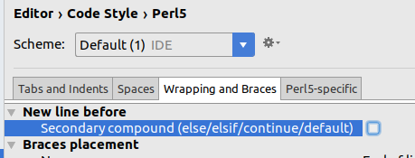

newspaper-fastcgi-ticket-checker
================================

Newspaper access ticker checker - Perl script running via fastcgi

In order to validate access to most resources (full pages, thumbnails
etc) we must check that the given request corresponds to the
credentials stored in JSON format in memcached for the ticket included
with the request.

What needs to be done in the ticket-checker to accept or decline a given URL:

1. Extract the ticket id from the URL.    The exact rule depends on the mediatype.
2. Look up the ticket id in memcached, to get a JSON snippet containing the ip-address, resource name, and
   resource type for which the ticket is valid.  All of these must be the same as in the URL for access to be
   allowed.
3. If not or if anything fails what so ever, access is denied.

Then (unless it is a DZI request which just pollutes the log) a log line is written containing information
needed for the usage statistics module (see /stats).

As the estimated initial workload were around 600 requests pr second
we decided that the best place to do this was inside the Apache server
itself, where the FcgidAccessChecker feature is a logical choice.
This requires a good FastCGI program which limits the technology
choices quite a bit.  We looked into a Java solution that turned out
to be premature, and then settled on using Perl.  TRA wrote the
initial version as simple as possible, and ABR, JRG and KFC later
adding writing the usage log.  TRA then updated the sources for Perl
5.16 used in production and did the initial Docker work.

Statistics of usage logs are processed by 
https://github.com/statsbiblioteket/newspaper-usage-statistics

From version 0.4 development is facilitated using Docker!

To build the necessary images:

    docker-compose build

Then use

    mvn clean install
    docker-compose up
    
to build Java mock services and get a development system running.

See

    FIXME:
    
for protected items.  (This is not done at the time of this writing. 

Statistics is accessed in a running system using FIXME.  

Remote testing:
---

(FIXME: rewrite)'

Apache on achernar is configured to use this project cloned to the
home directory.  When check.pl or CheckTicket.pm is updated run

    sudo /usr/local/sbin/restart_httpd.sh

to reload the script, and then run 

    perf/test-page.sh
     
which expects one or more lines containing a DOMS uuid on stdin, does
the proper voodoo, and then downloads the corresponding assets to the
"perf/tmp" folder.  As of 2015-06-19 this is hardcoded to the test
environment including achernar.

Use
http://achernar:7880/fedora/risearch?type=triples&lang=spo&format=N-Triples&limit=&dt=on&stream=on&query=*+*+%3Cinfo%3Afedora%2Fdoms%3AContentModel_EditionPage%3E&template=
to ask DOMS for test uuids.

Deployment:
---

FIXME:  Make Maven do it!

Run

    sh create-deployment-targz-sh
    
on a clean checkout to create tmp/newspaper-fastcgi-ticket-checker-$(head -n 1 CHANGELOG.md).tgz,
which can be sent to stage.

IntelliJ under Ubuntu configuration:
---

Earlier Emacs was used for development, but with the Docker migration it became feasible to
use IntelliJ.  Note that the default source code formatter needs a small configuration change
to conform to the previously used coding style.  The Settings -> Editor -> Code Style -> Perl 5 -> Wrapping and
Braces checkbox "New line before -> Secondary compound" checkbox needs to be _unchecked_!  See 

Also note that Ubuntu steals the Ctrl-Alt-L key combination.  It can be cleared in
System Settings ->  Keyboard -> Shortcuts -> System.  Select "Lock Screen" and press
backspace to clear.

/tra 2017-10-06
